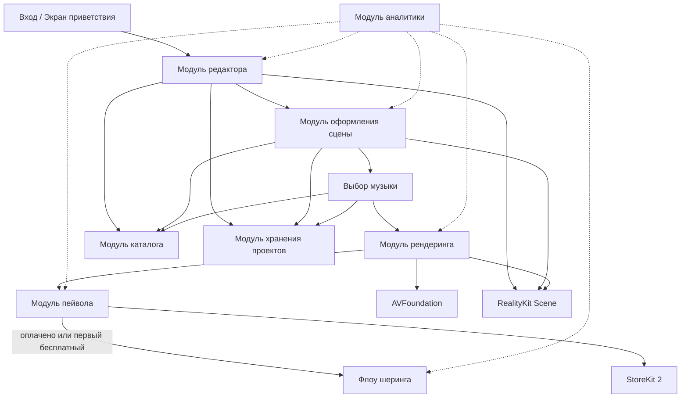
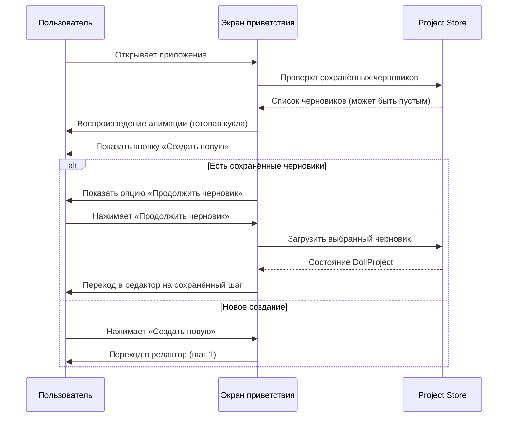
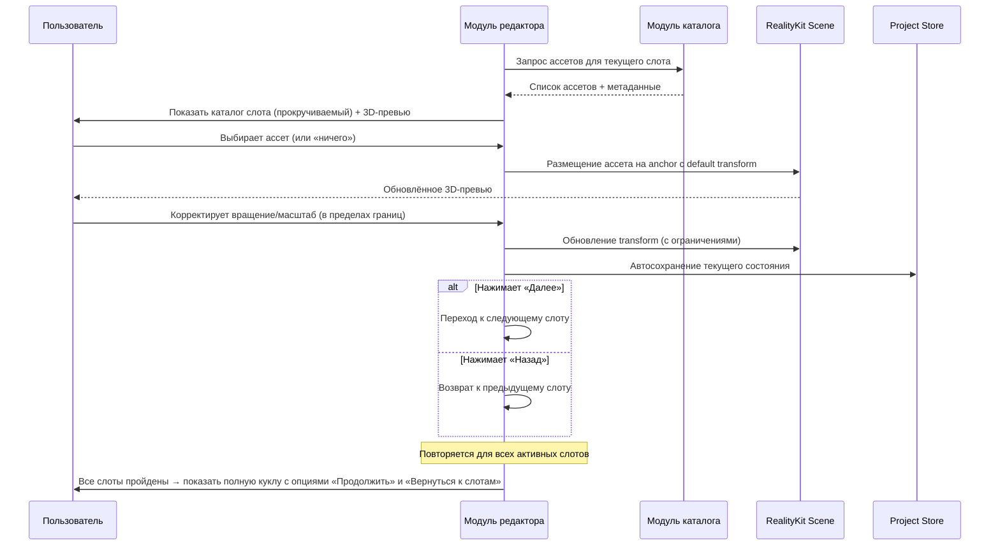
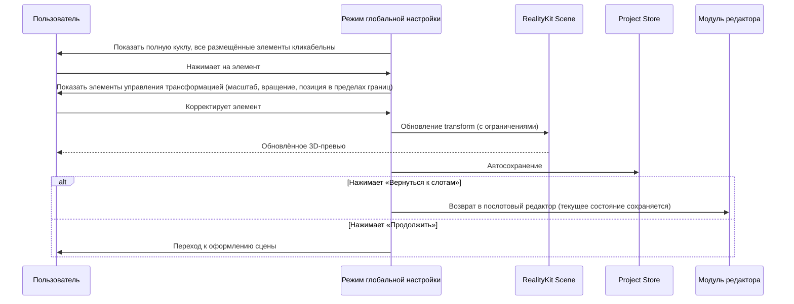
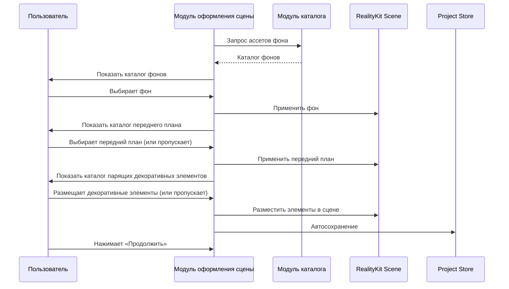
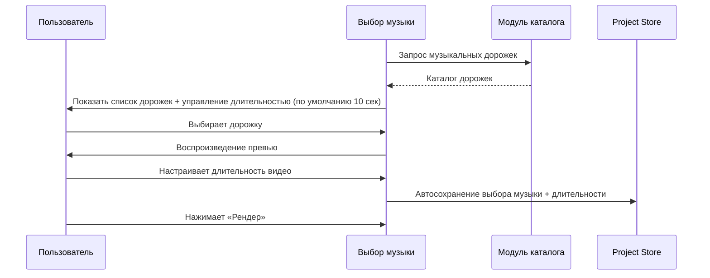
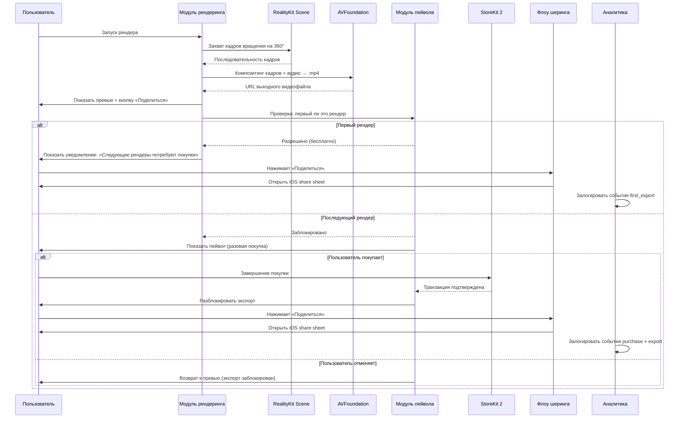
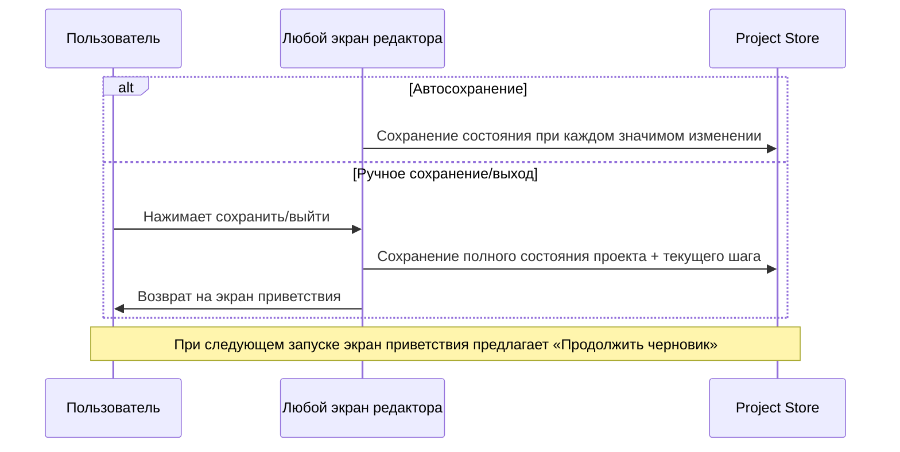

# Music Box Doll Builder — Техническая спецификация Phase 1

---

## Резюме

Приложение представляет собой конструктор виртуальных музыкальных шкатулок для iOS, ориентированный на пользователей, которые ценят эстетический и художественный контент. Пользователи собирают кастомную куклу из курированного каталога 3D-сканированных деталей, созданных специализированным художником кукол, выбирая элементы послотово (голова, волосы, аксессуары, тело, конечности, основание) с ограниченными трансформациями для сохранения визуального качества. После сборки кукла помещается в стилизованную сцену музыкальной шкатулки с фоном, передним планом и музыкальной дорожкой, затем рендерится в короткое зацикленное видео для публикации через нативный iOS share sheet. Монетизация начинается после первого успешного экспорта/шеринга — дальнейшее использование закрывается пейволом. Данная спецификация покрывает прототип Phase 1: один шаблон куклы, примерно 20–30 ассетов на 3–5 слотов, одна сцена, одна музыкальная дорожка, локальный рендеринг на устройстве и простой триггер пейвола.

---

## Требования

- **REQ-01** — Приложение должно запускаться с анимированным экраном приветствия, показывающим готовую куклу, которая приглашает пользователя в процесс создания.
- **REQ-02** — Приложение должно предоставлять пошаговый конструктор куклы по слотам: голова, волосы, шапка, рожки/нимб, корпус, внутренняя вставка, воротник, крылья, руки, рукава, нижняя часть, ноги/основание и хвост — с прокручиваемым каталогом доступных ассетов для каждого слота.
- **REQ-03** — Каждый слот должен включать пустой вариант (none), позволяющий пропустить любую категорию.
- **REQ-04** — Пользователь должен иметь возможность перемещаться вперёд и назад между слотами в любой момент в процессе сборки.
- **REQ-05** — Каждый ассет должен привязываться к предустановленной точке крепления (anchor point) и поддерживать ограниченное вращение (X, Y и вокруг собственной оси) и ограниченное масштабирование (в пределах min/max, определённых для каждого слота) — без свободного позиционирования для основных частей тела.
- **REQ-06** — После завершения послотового редактора приложение должно предоставить режим глобальной настройки, где пользователь может подкорректировать масштаб, вращение и позицию размещённых элементов в рамках заданных ограничений.
- **REQ-07** — После редактирования куклы приложение должно предоставить каталоги фона, переднего плана и парящих декоративных элементов для оформления сцены музыкальной шкатулки.
- **REQ-08** — После оформления сцены приложение должно предоставить экран выбора музыки с каталогом мелодий в стиле музыкальной шкатулки.
- **REQ-09** — Приложение должно рендерить короткое зацикленное видео на устройстве в формате 1080×1920 (вертикальное 9:16), показывающее куклу, вращающуюся внутри музыкальной шкатулки под выбранную музыкальную дорожку.
- **REQ-10** — Приложение должно открывать нативный iOS share sheet для публикации/экспорта отрендеренного видео в Instagram Reels, Stories или любое другое поддерживаемое направление.
- **REQ-11** — Первый экспорт/шеринг должен быть бесплатным; после первого успешного экспорта пейвол должен блокировать дальнейшие экспорты до завершения разовой покупки через StoreKit 2.
- **REQ-12** — Приложение должно позволять сохранять черновики проектов локально (максимум 5) и возобновлять их в последующих сессиях.
- **REQ-13** — Приложение Phase 1 должно поставляться с одним шаблоном куклы, 3–5 активными слотами, 20–30 встроенными ассетами, одним шаблоном сцены и одной музыкальной дорожкой — всё включено в бандл приложения без необходимости сети для сборки и экспорта.
- **REQ-14** — Весь флоу Phase 1 должен работать без создания аккаунта или авторизации (только гостевой режим).
- **REQ-15** — Приложение должно поддерживать восстановление разовой покупки через функцию restore в StoreKit 2.

---

## Технический стек

| Слой | Технология / Пакет | Примечания |
|---|---|---|
| **iOS UI** | Swift, SwiftUI | Минимальная версия iOS 17+ |
| **3D-движок** | RealityKit | Композиция сцены, привязка к слотам, ограниченные трансформации, рендеринг на устройстве |
| **3D-ассеты** | USDZ | Нативный формат RealityKit; конвертация из сканов через Reality Converter или Blender |
| **Экспорт видео** | AVFoundation | Композитинг отрендеренных кадров + аудио в 1080×1920 H.264/AAC .mp4 |
| **Монетизация** | StoreKit 2 | Разовая покупка, локальная валидация чека, поддержка restore |
| **Персистентность** | SwiftData | Локальное сохранение/загрузка черновиков проектов (нативно для iOS 17+) |
| **Шеринг** | UIActivityViewController | Нативный iOS share sheet для Reels/Stories и других направлений |
| **Аналитика** | TelemetryDeck | Privacy-friendly, GDPR-совместимый, лёгкий Swift SDK, бесплатный тариф |
| **CI/CD** | Xcode Cloud | 25 бесплатных часов/месяц в рамках Apple Developer Program; дистрибуция через TestFlight |
| **Бэкенд** | Нет (Phase 1) | Отложено до Phase 2; все данные и ассеты на устройстве |
| **Пайплайн ассетов** | Blender + Reality Converter | Очистка сканов, ретопология, оптимизация UV/текстур, экспорт в USDZ, настройка anchor/pivot |

---

## Архитектура

### Компоненты

#### Вход / Экран приветствия
- **Ответственность:** Анимированный экран приветствия с готовой куклой; точка входа в процесс создания или возобновления черновика
- **Предоставляет:** Навигацию к редактору или списку сохранённых черновиков
- **Зависит от:** Project Store (проверка существующих черновиков), Catalog (ассеты для куклы на экране приветствия), RealityKit Scene

#### Модуль редактора (Editor Module)
- **Ответственность:** Пошаговый конструктор куклы по слотам; управление навигацией по слотам (вперёд/назад), выбор ассетов для каждого слота, ограниченные элементы управления трансформацией (вращение X/Y/ось, масштаб в пределах границ) и режим глобальной настройки
- **Предоставляет:** Текущее состояние композиции куклы (выбранные ассеты + трансформации по слотам), API навигации по слотам
- **Зависит от:** Catalog Module (списки ассетов + метаданные по слотам), Project Store (автосохранение), RealityKit Scene (3D-превью)

#### Модуль оформления сцены (Scene Composer Module)
- **Ответственность:** Выбор и размещение фона, переднего плана и парящих декоративных элементов после завершения редактирования куклы
- **Предоставляет:** Состояние оформления сцены (выбранный фон, передний план, декоративные элементы + трансформации)
- **Зависит от:** Catalog Module, Project Store, RealityKit Scene

#### Выбор музыки (Music Selector)
- **Ответственность:** Отображение каталога музыкальных дорожек, воспроизведение превью, сохранение выбора
- **Предоставляет:** Ссылку на выбранную дорожку и метаданные (длительность, ссылка на файл)
- **Зависит от:** Catalog Module, Project Store

#### Модуль каталога (Catalog Module)
- **Ответственность:** Загрузка и предоставление метаданных ассетов и ссылок на USDZ для всех слотов, сцен, декоративных элементов и музыки; плоский список по каждому слоту без подкатегорий в Phase 1
- **Предоставляет:** Типизированные манифесты ассетов по категориям слотов, включая asset ID, display name, превью-миниатюру, ссылку на USDZ-файл, default transform, min/max scale, min/max rotation, anchor point, dependencies, exclusions
- **Зависит от:** Встроенные файлы ассетов в бандле приложения

#### Модуль хранения проектов (Project Store Module)
- **Ответственность:** Сохранение и восстановление черновиков проектов через SwiftData; фиксация полного состояния композиции (все выборы по слотам, трансформации, настройки сцены, выбор музыки, текущий шаг редактора)
- **Предоставляет:** Операции сохранения, загрузки, листинга и удаления черновиков
- **Зависит от:** SwiftData (iOS 17+)

#### Модуль рендеринга (Render Engine Module)
- **Ответственность:** Захват составленной RealityKit-сцены в виде видео с вращением на 360° в формате 1080×1920; композитинг аудиодорожки; вывод .mp4; настраиваемая пользователем длительность (по умолчанию 10 секунд)
- **Предоставляет:** Триггер рендера, callback прогресса, URL выходного файла
- **Зависит от:** RealityKit Scene (захват кадров), AVFoundation (композитинг видео + аудио)

#### Модуль пейвола (Paywall Module)
- **Ответственность:** Отслеживание, использовал ли пользователь бесплатный экспорт; отображение пейвола при втором и последующих экспортах; обработка разовой покупки и restore через StoreKit 2
- **Предоставляет:** Проверку прав (canExport → bool), триггер покупки, триггер restore
- **Зависит от:** StoreKit 2, UserDefaults (флаг бесплатного экспорта), Transaction.currentEntitlements (restore)

#### Флоу шеринга (Share Flow)
- **Ответственность:** Открытие нативного iOS share sheet с файлом отрендеренного видео
- **Предоставляет:** Триггер шеринга, принимающий URL видеофайла
- **Зависит от:** UIActivityViewController

#### Модуль аналитики (Analytics Module)
- **Ответственность:** Лёгкий трекинг событий по воронке; privacy-friendly, без PII
- **Предоставляет:** API трекинга событий (имя события + опциональные свойства)
- **Зависит от:** TelemetryDeck SDK

### Паттерны

- **Modular Swift Packages** — Каждый компонент является отдельным Swift-пакетом или таргетом в Xcode-проекте, обеспечивая чёткие границы зависимостей и тестируемость без избыточного усложнения в виде микросервисов
- **Slot-based composition model** — Кукла определяется как типизированный массив слотов, каждый из которых содержит опциональную ссылку на ассет и состояние трансформации; это делает сохранение/загрузку, валидацию и рендеринг детерминированными
- **Constrained transform envelope** — Каждый ассет содержит метаданные с допустимыми диапазонами трансформации; редактор применяет эти ограничения на уровне UI, предотвращая «сломанные» композиции
- **Entitlement-gated export** — Модуль пейвола оборачивает пайплайн рендер-шеринг единственной проверкой `canExport`, изолируя логику монетизации от творческого флоу
- **Offline-first** — Все ассеты встроены; вся персистентность локальная через SwiftData; никакой сетевой зависимости в Phase 1

### Модель данных

#### DollProject (SwiftData)

| Поле | Тип | Описание |
|---|---|---|
| id | UUID | Уникальный идентификатор проекта |
| name | String? | Опциональное пользовательское название |
| createdAt | Date | Дата создания |
| updatedAt | Date | Дата последнего изменения |
| currentStep | SlotType? | Шаг редактора для возобновления |
| slotSelections | [SlotSelection] | Массив привязок слот → ассет + трансформация |
| sceneBackground | AssetReference? | Выбранный фон |
| sceneForeground | AssetReference? | Выбранный передний план |
| sceneProps | [PropPlacement] | Размещённые парящие декоративные элементы |
| musicTrackID | String? | Ссылка на выбранную музыкальную дорожку |
| videoDuration | Double | Длительность рендера в секундах (по умолчанию 10.0) |

#### SlotSelection

| Поле | Тип | Описание |
|---|---|---|
| slotType | SlotType | Enum: head, hair, hat, horns, halo, bodyShell, innerInsert, collar, wings, leftHand, rightHand, leftSleeve, rightSleeve, lowerBody, feetBase, tail |
| assetID | String? | nil = слот пропущен |
| position | SIMD3<Float> | Смещение от anchor |
| rotation | SIMD3<Float> | Вращение по Эйлеру (ограниченное) |
| scale | Float | Равномерный масштаб (ограниченный) |

#### AssetManifestEntry (только для чтения, встроенный JSON)

| Поле | Тип | Описание |
|---|---|---|
| assetID | String | Уникальный идентификатор ассета |
| slotType | SlotType | К какому слоту относится |
| displayName | String | Название, отображаемое в каталоге |
| previewImage | String | Имя файла миниатюры |
| usdzFile | String | Имя USDZ-файла в бандле |
| defaultTransform | Transform | Позиция/вращение/масштаб по умолчанию |
| minScale | Float | Нижняя граница масштаба |
| maxScale | Float | Верхняя граница масштаба |
| minRotation | SIMD3<Float> | Нижние границы вращения по осям |
| maxRotation | SIMD3<Float> | Верхние границы вращения по осям |
| anchorPoint | SIMD3<Float> | Точка привязки в сцене |
| excludes | [String] | ID ассетов, несовместимых с данным |
| dependencies | [String] | ID ассетов, необходимых вместе с данным |

---

## Флоу

### 1. Запуск приложения

**Шаги:**
1. **Пользователь → Экран приветствия** — Открывает приложение; воспроизводится анимация с готовой куклой
2. **Экран приветствия → Project Store** — Проверка существующих сохранённых черновиков
3. **Экран приветствия → Пользователь** — Отображается кнопка «Создать новую» и, при наличии черновиков, опция «Продолжить черновик»
4. **Пользователь → Экран приветствия** — Нажимает «Создать новую» (начинает с первого слота) или «Продолжить черновик» (загружает сохранённое состояние и переходит к сохранённому шагу редактора)

---

### 2. Послотовый редактор

**Шаги:**
1. **Редактор → Каталог** — Запрашивает доступные ассеты для текущего типа слота
2. **Редактор → Пользователь** — Отображает прокручиваемый каталог с миниатюрами; каждый каталог включает вариант «ничего» для пропуска
3. **Пользователь → Редактор** — Выбирает ассет или «ничего»
4. **Редактор → RealityKit Scene** — Размещает выбранный ассет на предустановленной точке крепления с default transform; обновляет 3D-превью
5. **Пользователь → Редактор** — Опционально корректирует вращение (X, Y, собственная ось) и масштаб; редактор ограничивает значения в пределах метаданных
6. **Редактор → Project Store** — Автосохранение состояния композиции после каждого изменения
7. **Пользователь → Редактор** — Нажимает «Далее» для перехода к следующему слоту или «Назад» для возврата к предыдущему
8. **Редактор → Пользователь** — После последнего слота показывает полностью собранную куклу с возможностью перейти к глобальной настройке или вернуться к любому слоту

---

### 3. Глобальная настройка

**Шаги:**
1. **Глобальная настройка → Пользователь** — Показывает полностью собранную куклу; каждый размещённый элемент доступен для нажатия
2. **Пользователь → Глобальная настройка** — Нажимает на элемент для его выбора; появляются элементы управления трансформацией
3. **Пользователь → Глобальная настройка** — Корректирует масштаб, вращение или позицию; все изменения ограничены в пределах метаданных ассета
4. **Глобальная настройка → RealityKit Scene** — Применяет ограниченные обновления трансформации в реальном времени
5. **Глобальная настройка → Project Store** — Автосохранение после каждой корректировки
6. **Пользователь → Глобальная настройка** — Нажимает «Вернуться к слотам» для возврата в послотовый редактор или «Продолжить» для перехода к оформлению сцены

---

### 4. Оформление сцены

**Шаги:**
1. **Оформление сцены → Каталог** — Загружает каталоги фона, переднего плана и декоративных элементов последовательно
2. **Пользователь → Оформление сцены** — Выбирает фон из каталога; превью обновляется в реальном времени
3. **Пользователь → Оформление сцены** — Выбирает передний план (или пропускает); выбирает и размещает парящие декоративные элементы (или пропускает)
4. **Оформление сцены → Project Store** — Автосохранение состояния оформления сцены
5. **Пользователь → Оформление сцены** — Нажимает «Продолжить» для перехода к выбору музыки

---

### 5. Выбор музыки и настройка рендера

**Шаги:**
1. **Выбор музыки → Каталог** — Загружает доступные дорожки в стиле музыкальной шкатулки
2. **Выбор музыки → Пользователь** — Отображает список дорожек с воспроизведением превью и управление длительностью видео (по умолчанию 10 секунд)
3. **Пользователь → Выбор музыки** — Выбирает дорожку, слушает превью, настраивает длительность
4. **Выбор музыки → Project Store** — Автосохранение выбора
5. **Пользователь → Выбор музыки** — Нажимает «Рендер» для запуска генерации видео

---

### 6. Рендер, пейвол и шеринг

**Шаги:**
1. **Пользователь → Модуль рендеринга** — Запускает рендер с экрана выбора музыки
2. **Модуль рендеринга → RealityKit Scene** — Захватывает вращение на 360° за настроенную длительность
3. **Модуль рендеринга → AVFoundation** — Композитинг последовательности кадров с выбранной аудиодорожкой в 1080×1920 .mp4
4. **Модуль рендеринга → Пользователь** — Показывает превью видео с кнопкой «Поделиться»
5. **Модуль рендеринга → Модуль пейвола** — Проверка статуса прав
6. **Если первый рендер:** Шеринг доступен сразу; пользователь видит уведомление о том, что последующие рендеры потребуют покупки; share sheet открывается по нажатию
7. **Если последующий рендер:** Появляется экран пейвола; пользователь может завершить разовую покупку через StoreKit 2 для разблокировки или отменить и вернуться к превью без экспорта
8. **Аналитика** — Логируются события рендера, экспорта, показа пейвола и покупки

---

### 7. Сохранение и возобновление черновиков

**Шаги:**
1. **Приложение → Project Store** — Автосохранение после каждого значимого изменения состояния (выбор ассета, корректировка трансформации, выбор сцены/музыки)
2. **Пользователь → Приложение** — Может вручную сохранить и выйти в любой момент; полное состояние включая текущий шаг редактора сохраняется
3. **Экран приветствия → Пользователь** — При следующем запуске приложения предлагает «Продолжить черновик», который загружает сохранённое состояние и переходит точно на тот шаг, где пользователь остановился

---

## Критерии приёмки

### iOS UI / Навигация

- **AC-01** — Приложение запускается и анимация экрана приветствия начинает воспроизводиться в течение 2 секунд после нажатия на iPhone 12 или новее *(REQ-01)*
- **AC-02** — Экран приветствия отображает кнопку «Создать новую»; при наличии сохранённых черновиков также видна опция «Продолжить черновик» *(REQ-01, REQ-12)*
- **AC-03** — Возобновление черновика восстанавливает точное состояние композиции (все выборы по слотам, трансформации, сцена, музыка, длительность) и переходит к шагу редактора, на котором пользователь остановился *(REQ-12)*
- **AC-04** — Максимум 5 сохранённых черновиков; при достижении лимита пользователю предлагается удалить существующий черновик перед созданием нового *(REQ-12)*
- **AC-05** — Кнопки «Далее» и «Назад» работают на каждом экране слота; пользователь может свободно перемещаться между всеми слотами без потери выборов *(REQ-04)*

### Редактор / 3D-композиция

- **AC-06** — Каждый слот представляет прокручиваемый каталог доступных ассетов плюс вариант «ничего»; выбор «ничего» удаляет ранее размещённый ассет для этого слота *(REQ-02, REQ-03)*
- **AC-07** — Выбор ассета привязывает его к предустановленной точке крепления с default transform, определённым в манифесте ассета *(REQ-05)*
- **AC-08** — Элементы управления вращением ограничиваются значениями min/max rotation из манифеста ассета по всем трём осям; элементы управления масштабом ограничиваются значениями min/max scale *(REQ-05)*
- **AC-09** — Свободное перетаскивание для основных частей тела недоступно; смещение позиции доступно только в режиме глобальной настройки в пределах ограниченного диапазона *(REQ-05, REQ-06)*
- **AC-10** — Режим глобальной настройки отображает все размещённые элементы как кликабельные; выбор элемента показывает элементы управления трансформацией; «Вернуться к слотам» возвращает в послотовый редактор с сохранением текущего состояния *(REQ-06)*
- **AC-11** — Состояние автосохраняется после каждого выбора ассета или изменения трансформации; ручной выход сохраняет полное состояние включая текущий шаг *(REQ-12)*

### Сцена и музыка

- **AC-12** — Каталоги фона, переднего плана и парящих декоративных элементов включают вариант «ничего»; превью сцены обновляется в реальном времени при изменении выборов *(REQ-07)*
- **AC-13** — Экран выбора музыки отображает доступные дорожки с воспроизводимым превью и слайдер длительности; длительность по умолчанию — 10 секунд *(REQ-08)*
- **AC-14** — Изменение слайдера длительности обновляет сохранённую длительность видео и сохраняется через автосохранение *(REQ-08)*

### Рендер и экспорт

- **AC-15** — Нажатие «Рендер» создаёт вертикальное видео 1080×1920 в формате .mp4, в котором кукла совершает полный оборот на 360° за настроенную длительность под выбранную музыкальную дорожку *(REQ-09)*
- **AC-16** — Рендер завершается в течение 60 секунд на iPhone 12 *(REQ-09)*
- **AC-17** — После рендера отображается превью видео с кнопкой «Поделиться» *(REQ-09, REQ-10)*
- **AC-18** — Нажатие «Поделиться» открывает нативный iOS share sheet с прикреплённым .mp4 файлом; Instagram Reels/Stories отображаются как направления для шеринга при установленном Instagram *(REQ-10)*

### Пейвол и монетизация

- **AC-19** — Первый рендер завершается и шеринг доступен без пейвола; видимое уведомление информирует пользователя о том, что последующие рендеры потребуют покупки *(REQ-11)*
- **AC-20** — Второй и все последующие рендеры активируют экран пейвола до того, как кнопка шеринга становится доступна *(REQ-11)*
- **AC-21** — Завершение разовой покупки через StoreKit 2 немедленно разблокирует экспорт; все последующие рендеры проходят без пейвола *(REQ-11)*
- **AC-22** — Состояние покупки сохраняется после удаления и переустановки приложения; вызов restore purchase восстанавливает права *(REQ-15)*
- **AC-23** — Если пользователь отменяет пейвол, он возвращается к экрану превью видео; отрендеренное видео не теряется, но экспорт остаётся заблокированным *(REQ-11)*

### Контент / Каталог

- **AC-24** — Приложение Phase 1 поставляется с одним шаблоном куклы, 3–5 активными слотами, 20–30 ассетами, одним шаблоном сцены (фон + передний план) и одной музыкальной дорожкой, встроенными в бандл приложения *(REQ-13)*
- **AC-25** — Весь процесс создания, рендера и шеринга завершается без сетевого подключения *(REQ-13, REQ-14)*
- **AC-26** — Никаких запросов на вход, создание аккаунта или авторизацию не появляется ни на одном этапе в Phase 1 *(REQ-14)*

### Аналитика

- **AC-27** — События TelemetryDeck логируются для: запуск приложения, начало редактирования, завершение каждого слота, вход в глобальную настройку, завершение оформления сцены, выбор музыки, запуск рендера, завершение рендера, показ пейвола, завершение покупки, инициация шеринга — всё без сбора PII

### Производительность

- **AC-28** — Приложение не падает в течение полного цикла создание-экспорт на iPhone 12 с iOS 17
- **AC-29** — 3D-превью в редакторе поддерживает интерактивную частоту кадров (минимум 30 fps) во время выбора ассетов и манипуляций с трансформацией на iPhone 12
