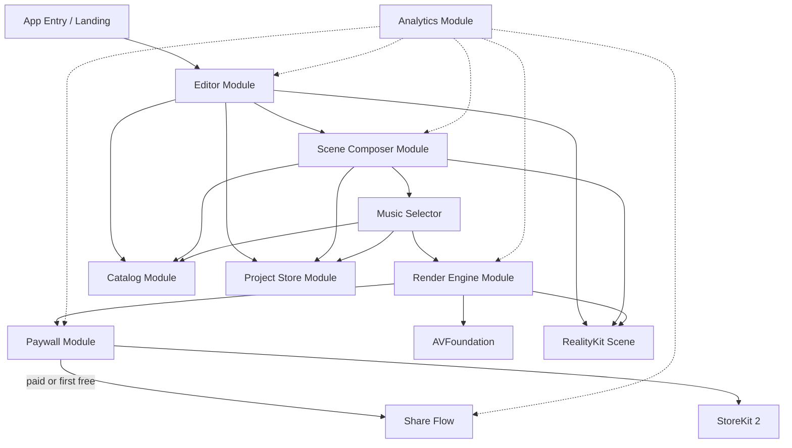
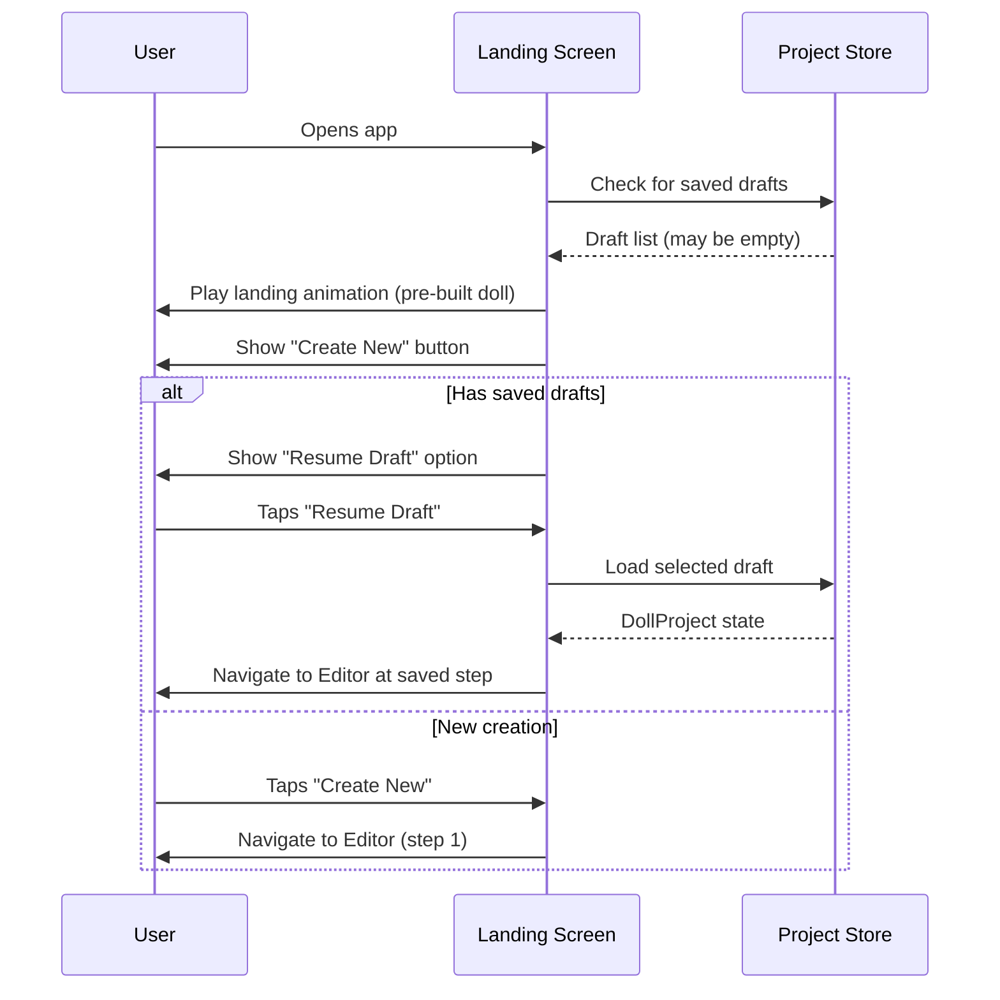
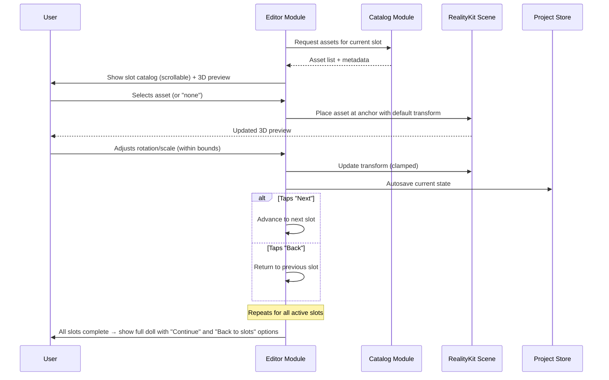
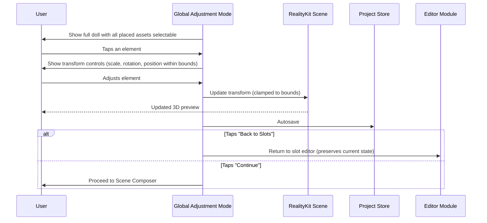
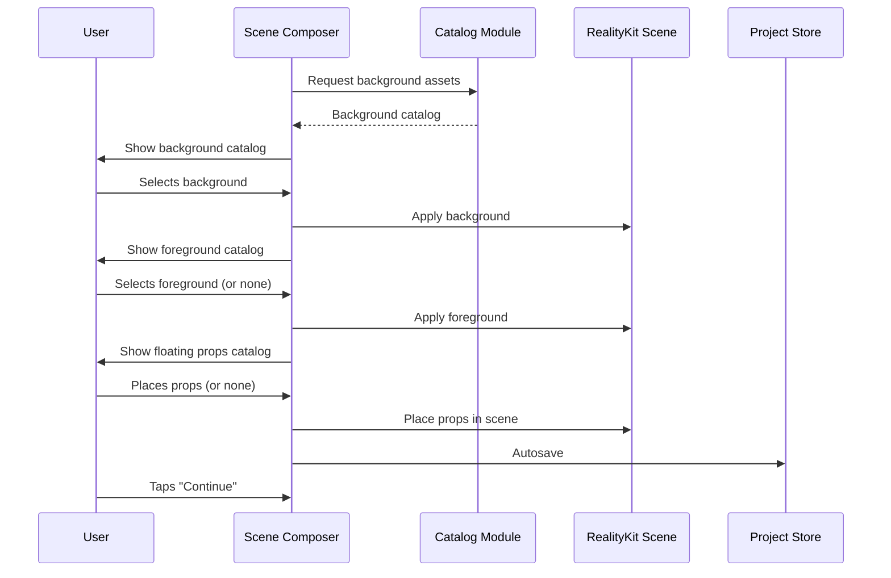
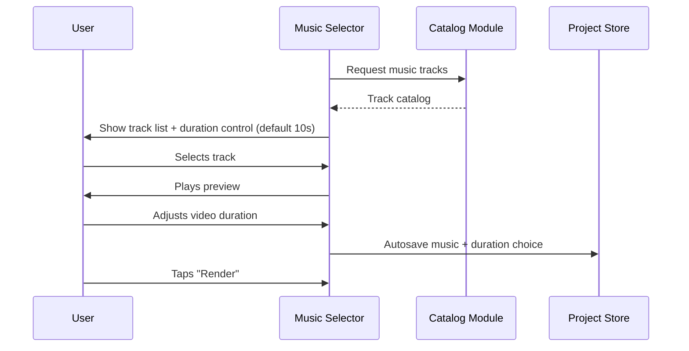
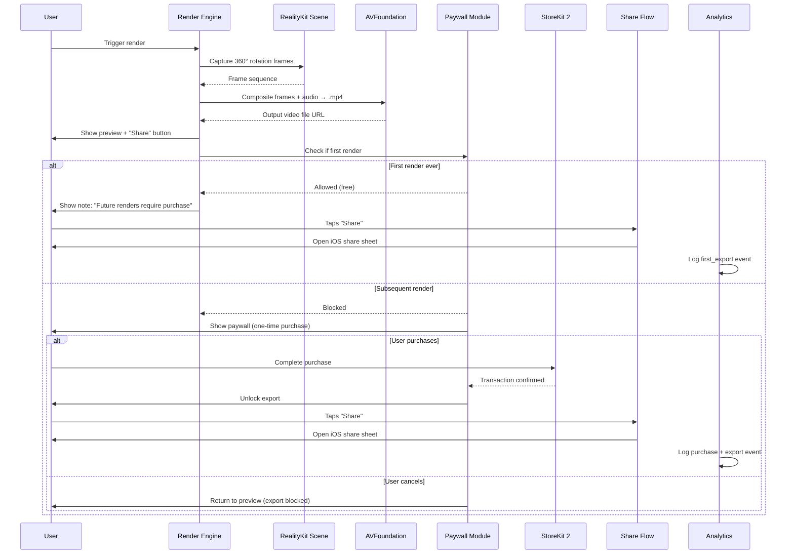
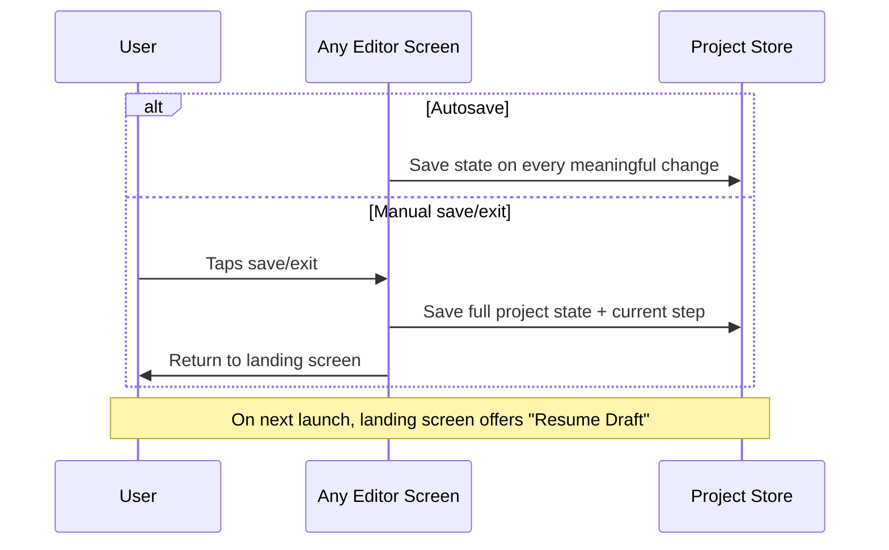

# Music Box Doll Builder — Phase 1 Technical Specification

---

## Summary

The app is a virtual music-box builder for iOS, targeting users who appreciate aesthetic and artistic content. Users assemble a custom doll from a curated catalog of 3D-scanned parts created by a specialist doll artist, choosing elements slot by slot (head, hair, accessories, body, limbs, base) with constrained transforms to preserve visual quality. Once assembled, the doll is placed inside a stylized music-box scene with a background, foreground decorations, and a music track, then rendered as a short looping video for sharing via the native iOS share sheet. Monetization begins after the user's first successful export/share, with a paywall gating subsequent use. This spec covers the Phase 1 prototype: one doll template, approximately 20–30 assets across 3–5 slots, one scene, one music track, local on-device rendering, and a simple paywall trigger.

---

## Requirements

- **REQ-01** — The app shall launch with an animated landing screen showing a pre-built doll that invites the user into the creation flow.
- **REQ-02** — The app shall present a step-by-step slot-based doll builder, progressing through head, hair, hat, horns/halo, body shell, inner insert, collar, wings, hands, sleeves, lower body, feet/base, and tail — with each slot showing a scrollable catalog of available assets.
- **REQ-03** — Every slot shall include an empty/none option, allowing the user to skip any category.
- **REQ-04** — Users shall be able to navigate backward and forward between slots at any time during the build flow.
- **REQ-05** — Each asset shall snap to a predefined anchor point and support constrained rotation (X, Y, and around own axis) and constrained scale (within min/max bounds defined per slot) — no freeform positioning for core body parts.
- **REQ-06** — After completing the slot-by-slot editor, the app shall present a global adjustment mode where the user can tweak scale, rotation, and position of placed elements within enforced bounds.
- **REQ-07** — After doll editing, the app shall present catalogs for background, foreground, and floating decorative props to style the music-box scene.
- **REQ-08** — After scene decoration, the app shall present a music selection screen with a catalog of music-box-style tracks.
- **REQ-09** — The app shall render a short looping video on-device at 1080×1920 (9:16 vertical) showing the doll rotating inside the music box with the selected music track.
- **REQ-10** — The app shall open the native iOS share sheet to let the user share/export the rendered video to Instagram Reels, Stories, or any supported destination.
- **REQ-11** — The first export/share shall be free; after the first successful export, a paywall shall block further exports until the user completes a one-time in-app purchase via StoreKit 2.
- **REQ-12** — The app shall allow saving draft projects locally (maximum 5) and resuming them in a later session.
- **REQ-13** — The Phase 1 app shall ship with one doll template, 3–5 active slots, 20–30 bundled assets, one scene template, and one music track — all included in the app bundle with no network required to build and export.
- **REQ-14** — The entire Phase 1 flow shall work without user account creation or sign-in (guest-only).
- **REQ-15** — The app shall support restoring the one-time purchase via StoreKit 2 restore functionality.

---

## Technical Stack

| Layer | Technology / Package | Notes |
|---|---|---|
| **iOS UI** | Swift, SwiftUI | iOS 17+ minimum deployment target |
| **3D Engine** | RealityKit | Scene composition, slot anchoring, constrained transforms, on-device render |
| **3D Assets** | USDZ | Native RealityKit format; convert from scans via Reality Converter or Blender |
| **Video Export** | AVFoundation | Composites rendered frames + audio into 1080×1920 H.264/AAC .mp4 |
| **Monetization** | StoreKit 2 | One-time purchase, local receipt validation, restore support |
| **Persistence** | SwiftData | Local draft project save/load (iOS 17+ native) |
| **Sharing** | UIActivityViewController | Native iOS share sheet for Reels/Stories/any target |
| **Analytics** | TelemetryDeck | Privacy-friendly, GDPR-compliant, lightweight Swift SDK, free tier |
| **CI/CD** | Xcode Cloud | 25 free hours/month with Apple Developer Program; TestFlight distribution |
| **Backend** | None (Phase 1) | Deferred to Phase 2; all data and assets on-device |
| **Asset Pipeline** | Blender + Reality Converter | Scan cleanup, retopo, UV/texture optimization, USDZ export, anchor/pivot setup |

---

## Architecture

### Components

#### App Entry / Landing
- **Responsibility:** Animated landing screen with pre-built doll; entry point into creation flow or draft resume
- **Exposes:** Navigation to Editor or saved draft list
- **Depends on:** Project Store (to check for existing drafts), Catalog (for landing doll assets), RealityKit Scene

#### Editor Module
- **Responsibility:** Step-by-step slot-based doll builder; manages slot navigation (forward/back), asset selection per slot, constrained transform controls (rotate X/Y/axis, scale within bounds), and global adjustment mode
- **Exposes:** Current doll composition state (selected assets + transforms per slot), slot navigation API
- **Depends on:** Catalog Module (asset lists + metadata per slot), Project Store (autosave), RealityKit Scene (3D preview)

#### Scene Composer Module
- **Responsibility:** Background, foreground, and floating prop selection and placement after doll editing is complete
- **Exposes:** Scene decoration state (selected background, foreground, props + transforms)
- **Depends on:** Catalog Module, Project Store, RealityKit Scene

#### Music Selector
- **Responsibility:** Presents music track catalog, plays preview, stores selection
- **Exposes:** Selected track reference and metadata (duration, file reference)
- **Depends on:** Catalog Module, Project Store

#### Catalog Module
- **Responsibility:** Loads and provides asset metadata and USDZ references for all slots, scenes, props, and music; flat list per slot with no subcategories in Phase 1
- **Exposes:** Typed asset manifests per slot category, including asset ID, display name, preview thumbnail, USDZ file reference, default transform, min/max scale, min/max rotation, anchor point, dependencies, exclusions
- **Depends on:** Bundled asset files in app package

#### Project Store Module
- **Responsibility:** Persists and restores draft projects using SwiftData; captures full composition state (all slot selections, transforms, scene choices, music choice, current editor step)
- **Exposes:** Save, load, list, delete draft operations
- **Depends on:** SwiftData (iOS 17+)

#### Render Engine Module
- **Responsibility:** Captures the composed RealityKit scene as a 360° rotation video at 1080×1920; composites audio track; outputs .mp4; user-configurable duration (default 10s)
- **Exposes:** Render trigger, progress callback, output file URL
- **Depends on:** RealityKit Scene (frame capture), AVFoundation (video + audio composition)

#### Paywall Module
- **Responsibility:** Tracks whether the user has used their free export; presents paywall on second+ export; handles one-time purchase and restore via StoreKit 2
- **Exposes:** Entitlement check (canExport → bool), purchase flow trigger, restore flow trigger
- **Depends on:** StoreKit 2, UserDefaults (free export flag), Transaction.currentEntitlements (restore)

#### Share Flow
- **Responsibility:** Opens native iOS share sheet with rendered video file
- **Exposes:** Share trigger accepting video file URL
- **Depends on:** UIActivityViewController

#### Analytics Module
- **Responsibility:** Lightweight event tracking across the funnel; privacy-friendly, no PII
- **Exposes:** Track event API (event name + optional properties)
- **Depends on:** TelemetryDeck SDK

### Patterns

- **Modular Swift Packages** — Each component is a distinct Swift package or target within the Xcode project, enabling clean dependency boundaries and testability without over-engineering into microservices
- **Slot-based composition model** — The doll is defined as a typed array of slots, each holding an optional asset reference and transform state; this makes save/load, validation, and rendering deterministic
- **Constrained transform envelope** — Every asset carries metadata defining allowed transform ranges; the Editor enforces these bounds at the UI layer, preventing broken compositions
- **Entitlement-gated export** — The Paywall module wraps the render-to-share pipeline with a single `canExport` check, keeping monetization logic isolated from the creative flow
- **Offline-first** — All assets bundled; all persistence local via SwiftData; no network dependency in Phase 1

### Data Model

#### DollProject (SwiftData)

| Field | Type | Description |
|---|---|---|
| id | UUID | Unique project identifier |
| name | String? | Optional user label |
| createdAt | Date | Creation timestamp |
| updatedAt | Date | Last modified timestamp |
| currentStep | SlotType? | Editor step to resume from |
| slotSelections | [SlotSelection] | Array of slot → asset + transform mappings |
| sceneBackground | AssetReference? | Selected background |
| sceneForeground | AssetReference? | Selected foreground |
| sceneProps | [PropPlacement] | Placed floating decorations |
| musicTrackID | String? | Selected music track reference |
| videoDuration | Double | Render duration in seconds (default 10.0) |

#### SlotSelection

| Field | Type | Description |
|---|---|---|
| slotType | SlotType | Enum: head, hair, hat, horns, halo, bodyShell, innerInsert, collar, wings, leftHand, rightHand, leftSleeve, rightSleeve, lowerBody, feetBase, tail |
| assetID | String? | nil = skipped slot |
| position | SIMD3<Float> | Offset from anchor |
| rotation | SIMD3<Float> | Euler rotation (bounded) |
| scale | Float | Uniform scale (bounded) |

#### AssetManifestEntry (read-only, bundled JSON)

| Field | Type | Description |
|---|---|---|
| assetID | String | Unique asset identifier |
| slotType | SlotType | Which slot this belongs to |
| displayName | String | Label shown in catalog |
| previewImage | String | Thumbnail filename |
| usdzFile | String | USDZ filename in bundle |
| defaultTransform | Transform | Default position/rotation/scale |
| minScale | Float | Lower scale bound |
| maxScale | Float | Upper scale bound |
| minRotation | SIMD3<Float> | Lower rotation bounds per axis |
| maxRotation | SIMD3<Float> | Upper rotation bounds per axis |
| anchorPoint | SIMD3<Float> | Snap-to point in scene |
| excludes | [String] | Asset IDs incompatible with this one |
| dependencies | [String] | Asset IDs required alongside this one |

---

## Flows

### 1. App Launch Flow

**Steps:**
1. **User → Landing Screen** — Opens the app; landing animation plays showing a pre-built doll
2. **Landing Screen → Project Store** — Checks for existing saved drafts
3. **Landing Screen → User** — Displays "Create New" button and, if drafts exist, a "Resume Draft" option
4. **User → Landing Screen** — Taps either "Create New" (starts fresh at first slot) or "Resume Draft" (loads saved state and jumps to the saved editor step)

---

### 2. Slot-by-Slot Editor Flow

**Steps:**
1. **Editor → Catalog** — Requests available assets for the current slot type
2. **Editor → User** — Displays scrollable catalog sidebar with thumbnails; each catalog includes a "none" option to skip
3. **User → Editor** — Selects an asset or "none"
4. **Editor → RealityKit Scene** — Places selected asset at predefined anchor with default transform; updates 3D preview
5. **User → Editor** — Optionally adjusts rotation (X, Y, own axis) and scale; Editor clamps values to metadata bounds
6. **Editor → Project Store** — Autosaves composition state after each change
7. **User → Editor** — Taps "Next" to advance to next slot, or "Back" to revisit a previous slot
8. **Editor → User** — After final slot, shows full assembled doll with option to continue to global adjustment or go back to any slot

---

### 3. Global Adjustment Flow

**Steps:**
1. **Global Adjustment → User** — Shows the fully assembled doll; each placed element is tappable
2. **User → Global Adjustment** — Taps an element to select it; transform controls appear
3. **User → Global Adjustment** — Adjusts scale, rotation, or position; all changes clamped to per-asset bounds
4. **Global Adjustment → RealityKit Scene** — Applies clamped transform updates in real time
5. **Global Adjustment → Project Store** — Autosaves after each adjustment
6. **User → Global Adjustment** — Taps "Back to Slots" to return to the slot-by-slot editor, or "Continue" to proceed to scene decoration

---

### 4. Scene Decoration Flow

**Steps:**
1. **Scene Composer → Catalog** — Loads background, foreground, and prop catalogs sequentially
2. **User → Scene Composer** — Selects background from catalog; preview updates in real time
3. **User → Scene Composer** — Selects foreground (or skips); selects and places floating decorative props (or skips)
4. **Scene Composer → Project Store** — Autosaves scene decoration state
5. **User → Scene Composer** — Taps "Continue" to proceed to music selection

---

### 5. Music Selection & Render Config Flow

**Steps:**
1. **Music Selector → Catalog** — Loads available music-box tracks
2. **Music Selector → User** — Displays track list with play-preview and a video duration control (default 10 seconds)
3. **User → Music Selector** — Selects a track, listens to preview, adjusts duration
4. **Music Selector → Project Store** — Autosaves selection
5. **User → Music Selector** — Taps "Render" to trigger video generation

---

### 6. Render, Paywall & Share Flow

**Steps:**
1. **User → Render Engine** — Triggers render from music selection screen
2. **Render Engine → RealityKit Scene** — Captures a 360° rotation over the configured duration
3. **Render Engine → AVFoundation** — Composites frame sequence with selected audio track into 1080×1920 .mp4
4. **Render Engine → User** — Shows video preview with "Share" button
5. **Render Engine → Paywall Module** — Checks entitlement status
6. **If first render:** Share is allowed immediately; user sees a note that future renders will require purchase; share sheet opens on tap
7. **If subsequent render:** Paywall screen appears; user can complete one-time purchase via StoreKit 2 to unlock, or cancel and return to preview without exporting
8. **Analytics** — Logs render, export, paywall impression, and purchase events

---

### 7. Draft Save & Resume Flow

**Steps:**
1. **App → Project Store** — Autosaves after every meaningful state change (asset selection, transform adjustment, scene/music choice)
2. **User → App** — Can manually save and exit at any point; full state including current editor step is persisted
3. **Landing Screen → User** — On next app launch, offers "Resume Draft" which loads saved state and navigates to the exact step the user left off

---

## Acceptance Criteria

### iOS UI / Navigation

- **AC-01** — App launches and landing animation begins playing within 2 seconds of tap on iPhone 12 or newer *(REQ-01)*
- **AC-02** — Landing screen displays "Create New" button; if saved drafts exist, a "Resume Draft" option is also visible *(REQ-01, REQ-12)*
- **AC-03** — Resuming a draft restores the exact composition state (all slot selections, transforms, scene, music, duration) and navigates to the editor step where the user left off *(REQ-12)*
- **AC-04** — Maximum of 5 saved drafts; when the limit is reached, the user is prompted to delete an existing draft before creating a new one *(REQ-12)*
- **AC-05** — "Next" and "Back" buttons are functional on every slot screen; the user can navigate freely between all slots without losing selections *(REQ-04)*

### Editor / 3D Composition

- **AC-06** — Each slot presents a scrollable catalog of available assets plus a "none" option; selecting "none" removes any previously placed asset for that slot *(REQ-02, REQ-03)*
- **AC-07** — Selecting an asset snaps it to the predefined anchor point with the default transform defined in the asset manifest *(REQ-05)*
- **AC-08** — Rotation controls clamp to the min/max rotation values from the asset manifest on all three axes; scale controls clamp to min/max scale values *(REQ-05)*
- **AC-09** — No freeform drag-positioning is available for core body parts; position offset is only available in global adjustment mode within bounded range *(REQ-05, REQ-06)*
- **AC-10** — Global adjustment mode displays all placed elements as tappable; selecting one shows transform controls; "Back to Slots" returns to the slot editor preserving all current state *(REQ-06)*
- **AC-11** — State autosaves after every asset selection or transform change; manually exiting saves full state including current step *(REQ-12)*

### Scene & Music

- **AC-12** — Background, foreground, and floating prop catalogs each include a "none" option; scene preview updates in real time as selections change *(REQ-07)*
- **AC-13** — Music selection screen displays available tracks with playable previews and a duration slider; default duration is 10 seconds *(REQ-08)*
- **AC-14** — Adjusting the duration slider updates the stored video duration and is persisted with autosave *(REQ-08)*

### Render & Export

- **AC-15** — Tapping "Render" produces a 1080×1920 vertical .mp4 video with the doll completing a 360° rotation over the configured duration, with the selected music track as audio *(REQ-09)*
- **AC-16** — Render completes within 60 seconds on iPhone 12 *(REQ-09)*
- **AC-17** — After render, a video preview is displayed with a "Share" button *(REQ-09, REQ-10)*
- **AC-18** — Tapping "Share" opens the native iOS share sheet with the rendered .mp4 file attached; Instagram Reels/Stories appear as share destinations when Instagram is installed *(REQ-10)*

### Paywall & Monetization

- **AC-19** — First render completes and share is accessible without any paywall; a visible note informs the user that future renders require purchase *(REQ-11)*
- **AC-20** — Second and all subsequent renders trigger the paywall screen before the share button is accessible *(REQ-11)*
- **AC-21** — Completing the one-time in-app purchase via StoreKit 2 immediately unlocks export; all future renders proceed without paywall *(REQ-11)*
- **AC-22** — Purchase state survives app deletion and reinstall; calling restore purchase recovers the entitlement *(REQ-15)*
- **AC-23** — If the user cancels the paywall, they return to the video preview screen; the rendered video is not lost but export remains blocked *(REQ-11)*

### Content / Catalog

- **AC-24** — Phase 1 app ships with one doll template, 3–5 active slots, 20–30 assets, one scene template (background + foreground), and one music track bundled in the app package *(REQ-13)*
- **AC-25** — The entire creation, render, and share flow completes with no network connection *(REQ-13, REQ-14)*
- **AC-26** — No sign-in, account creation, or authentication prompt appears at any point in Phase 1 *(REQ-14)*

### Analytics

- **AC-27** — TelemetryDeck events are logged for: app launch, editor start, each slot completion, global adjustment entry, scene decoration completion, music selection, render triggered, render completed, paywall shown, purchase completed, share initiated — all without collecting PII

### Performance

- **AC-28** — App does not crash during a full creation-to-export flow on iPhone 12 with iOS 17
- **AC-29** — 3D preview in the editor maintains interactive frame rate (minimum 30 fps) during asset selection and transform manipulation on iPhone 12
