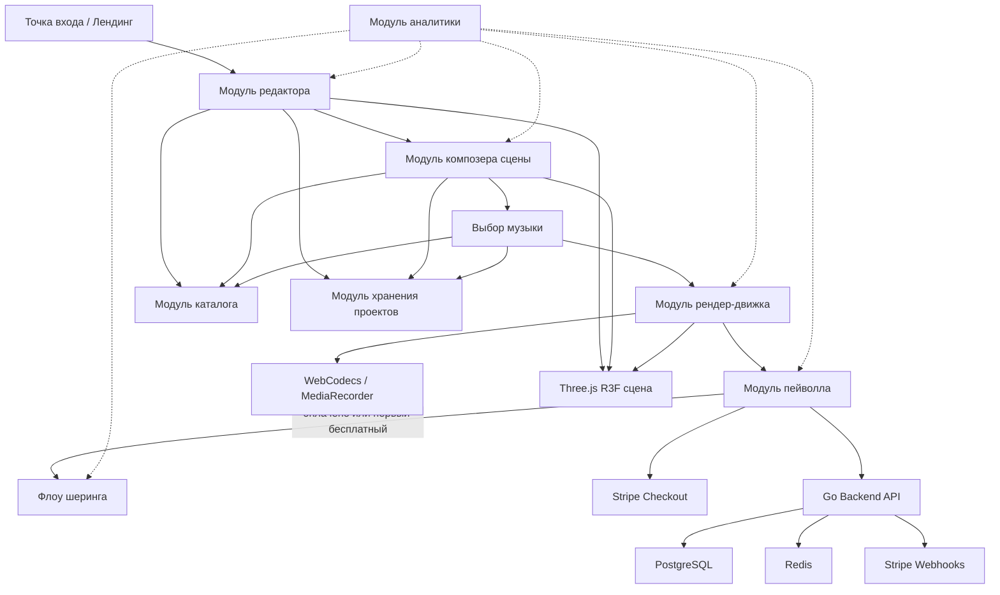
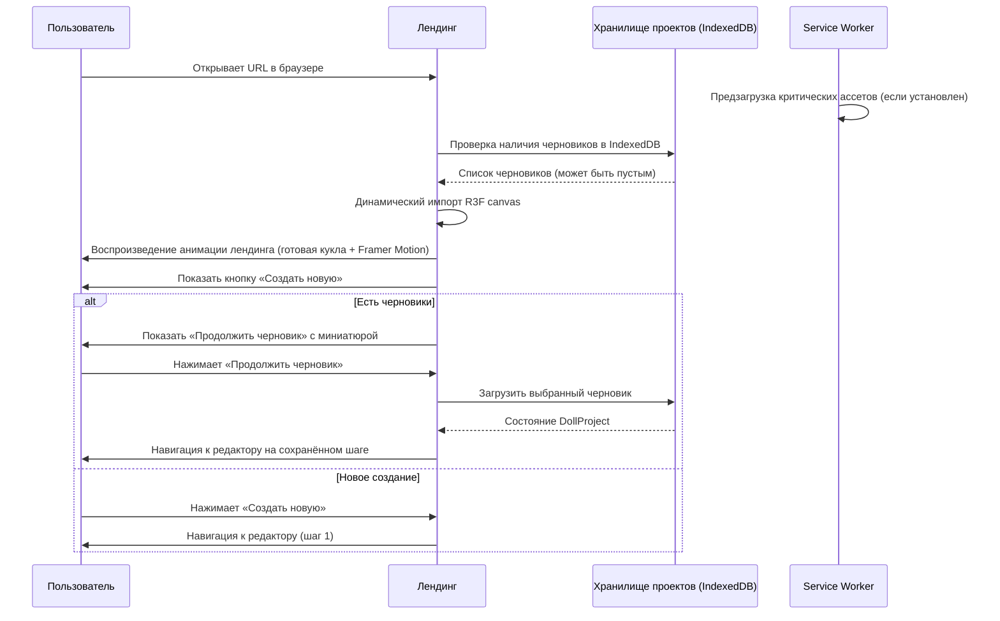
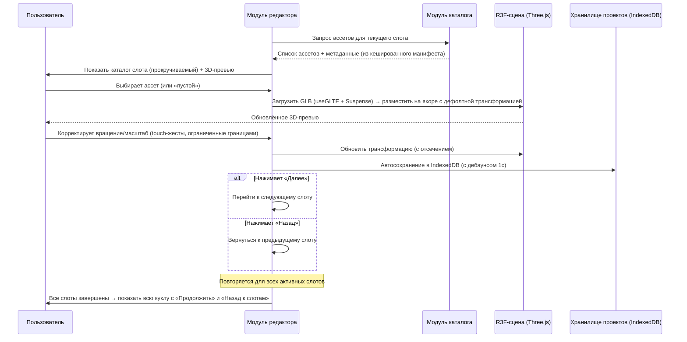
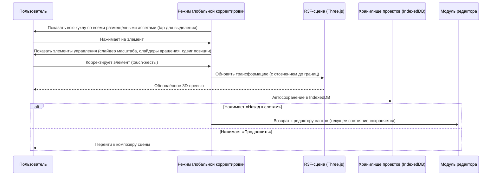
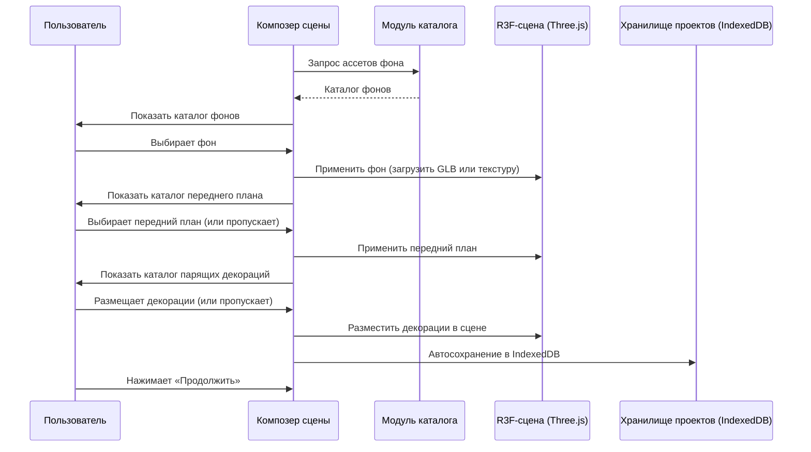
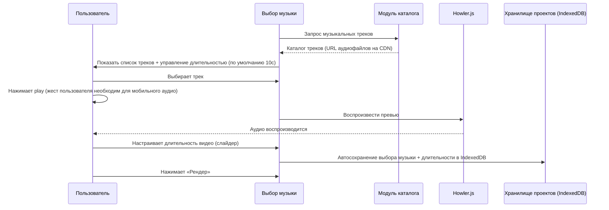
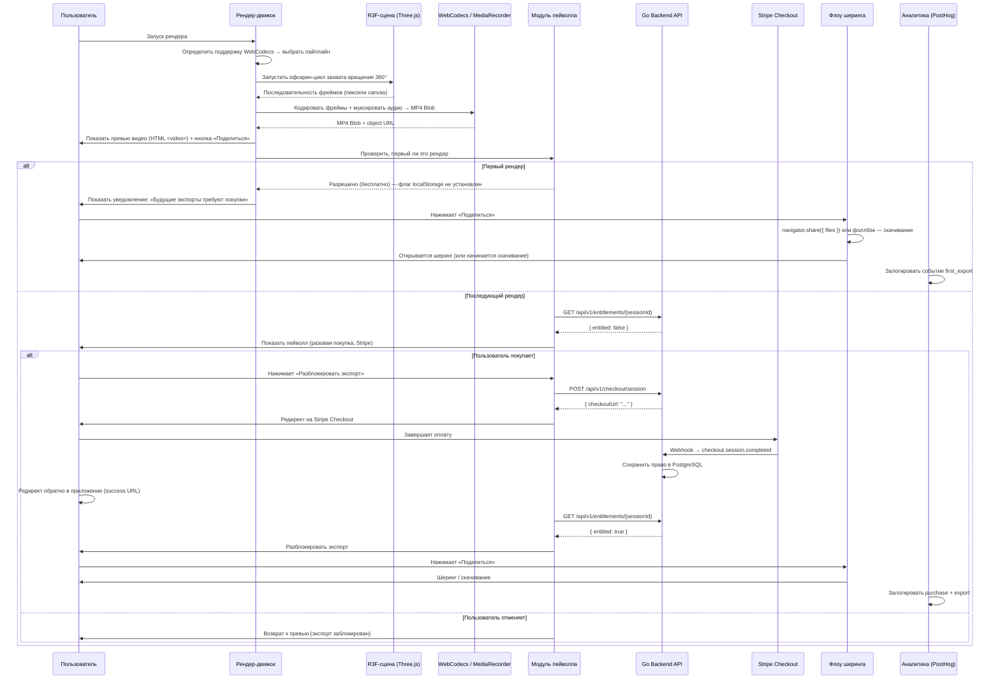
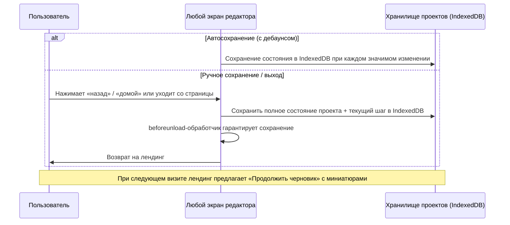

# Конструктор кукол в музыкальной шкатулке — Веб-приложение, техническая спецификация Фазы 1

---

## Краткое описание

Приложение представляет собой виртуальный конструктор музыкальных шкатулок, реализованный как mobile-first веб-приложение для пользователей, ценящих эстетический и художественный контент. Пользователи собирают кастомную куклу из курируемого каталога 3D-сканированных деталей, созданных художником-кукольником, выбирая элементы слот за слотом (голова, причёска, аксессуары, тело, конечности, основание) с ограниченными трансформациями для сохранения визуального качества. После сборки кукла помещается в стилизованную сцену музыкальной шкатулки с фоном, декорациями переднего плана и музыкальным треком, а затем рендерится как короткое зацикленное видео для шеринга через Web Share API или прямого скачивания. Монетизация начинается после первого успешного экспорта/шеринга, дальнейшее использование блокируется пейволлом на базе Stripe.

Основное целевое устройство — iPhone (Safari/Chrome), с использованием того же мощного оборудования, на котором работало бы нативное iOS-приложение, но с мгновенной дистрибуцией по URL без зависимости от App Store и без 30% комиссии платформы.

Данная спецификация покрывает прототип Фазы 1: один шаблон куклы, приблизительно 20–30 ассетов в 3–5 слотах, одна сцена, один музыкальный трек, локальный рендеринг в браузере и простой триггер пейволла.

---

## Требования

- **REQ-01** — Приложение должно запускаться с анимированным лендингом, показывающим готовую куклу, которая приглашает пользователя в процесс создания.
- **REQ-02** — Приложение должно представлять пошаговый конструктор куклы по слотам, проходящий через голову, причёску, шапочку, рожки/нимб, основу тела, внутреннюю вставку, воротник, крылья, руки, рукава, нижнюю часть, ноги/основание и хвост — с прокручиваемым каталогом доступных ассетов для каждого слота.
- **REQ-03** — Каждый слот должен включать пустой/none вариант, позволяющий пользователю пропустить любую категорию.
- **REQ-04** — Пользователи должны иметь возможность перемещаться назад и вперёд между слотами в любой момент процесса сборки.
- **REQ-05** — Каждый ассет должен привязываться к предопределённой якорной точке и поддерживать ограниченное вращение (X, Y и вокруг собственной оси) и ограниченный масштаб (в пределах мин/макс границ, определённых для каждого слота) — без свободного позиционирования основных частей тела.
- **REQ-06** — После завершения пошагового редактора приложение должно представить режим глобальной корректировки, где пользователь может настроить масштаб, вращение и положение размещённых элементов в пределах принудительных границ.
- **REQ-07** — После редактирования куклы приложение должно представить каталоги фона, переднего плана и парящих декоративных элементов для стилизации сцены музыкальной шкатулки.
- **REQ-08** — После декорирования сцены приложение должно представить экран выбора музыки с каталогом треков в стиле музыкальной шкатулки.
- **REQ-09** — Приложение должно рендерить короткое зацикленное видео в браузере в разрешении 1080×1920 (9:16, вертикальное), показывающее вращающуюся куклу в музыкальной шкатулке с выбранным музыкальным треком.
- **REQ-10** — Приложение должно предоставить Web Share API (мобильные) или прямое скачивание файла (десктоп) для шеринга/экспорта отрендеренного видео в Instagram Reels, Stories или любое другое поддерживаемое назначение.
- **REQ-11** — Первый экспорт/шеринг должен быть бесплатным; после первого успешного экспорта пейволл должен блокировать дальнейшие экспорты до завершения пользователем разовой покупки через Stripe Checkout.
- **REQ-12** — Приложение должно позволять сохранять черновики проектов локально через IndexedDB (максимум 5) и возобновлять их в последующих сессиях.
- **REQ-13** — Приложение Фазы 1 должно содержать один шаблон куклы, 3–5 активных слотов, 20–30 ассетов, доставляемых через CDN (кешируемых Service Worker для офлайн-редактирования), один шаблон сцены и один музыкальный трек.
- **REQ-14** — Весь флоу создания в Фазе 1 должен работать без создания аккаунта или авторизации (только гостевой режим через анонимную сессию).
- **REQ-15** — Приложение должно поддерживать восстановление разовой покупки через поиск аккаунта по email или клиентский портал Stripe.
- **REQ-16** — Приложение должно быть адаптивным, mobile-first Progressive Web App, устанавливаемым на домашний экран на iOS и Android.

---

## Технологический стек

| Уровень | Технология / Пакет | Примечания |
|---|---|---|
| **Фреймворк** | React 19, Next.js 15 (App Router), TypeScript | SSR для лендинга/маркетинга; CSR для 3D-редактора |
| **3D-движок** | Three.js через React Three Fiber (R3F) + Drei | Композиция сцены, привязка к слотам, ограниченные трансформации, рендеринг на экране |
| **3D-ассеты** | glTF 2.0 / GLB | Веб-стандарт; Draco-сжатие мешей, KTX2/Basis Universal текстуры |
| **Управление состоянием** | Zustand | Легковесный глобальный стор для состояния композиции, навигации редактора, прав доступа |
| **Стилизация** | Tailwind CSS | Утилитарный подход, mobile-first адаптивный дизайн |
| **Анимация (UI)** | Framer Motion | Анимация лендинга, переходы между страницами, UI-микроанимации |
| **Аудио** | Howler.js | Кроссбраузерное воспроизведение; обходит ограничения автовоспроизведения мобильного Safari |
| **Экспорт видео** | WebCodecs API + mp4-muxer (основной); MediaRecorder (фоллбэк) | Захват фреймов Three.js canvas → H.264 MP4 с аудио |
| **Шеринг** | Web Share API (мобильные); фоллбэк — скачивание (десктоп) | `navigator.share({ files: [...] })` для нативно ощущаемого шеринга |
| **Персистентность** | IndexedDB через idb | Локальное сохранение/загрузка черновиков проектов; максимум 5 черновиков |
| **PWA** | next-pwa / Workbox | Service Worker для кеширования ассетов, манифест для установки на домашний экран |
| **Монетизация** | Stripe Checkout | Разовая покупка; серверная верификация вебхуков; без комиссии платформы |
| **Аналитика** | PostHog (self-hosted или облако) | Приватность, GDPR-соответствие, воронка, фича-флаги |
| **Бэкенд** | Golang | Stripe-вебхуки, проверка прав, манифесты каталога, приём аналитики |
| **База данных** | PostgreSQL | Права доступа, записи покупок, маппинг анонимных сессий |
| **Кеш** | Redis | Рейт-лимиты, кеш прав, фича-флаги, горячий каталог |
| **CDN** | Cloudflare CDN / R2 | Доставка GLB-ассетов, KTX2-текстур, аудиофайлов, статики |
| **Хостинг (фронтенд)** | Vercel | Деплой, оптимизированный для Next.js, edge functions, preview deploys |
| **Хостинг (бэкенд)** | Fly.io или Railway | Деплой Go API, близко к пользователю |
| **CI/CD** | GitHub Actions | Линт, тесты, сборка, деплой на Vercel + бэкенд |
| **Наблюдаемость** | OpenTelemetry + Sentry (ошибки фронтенда) | Распределённый трейсинг на бэкенде; JS error tracking на фронтенде |

---

## Архитектура



### Компоненты

#### Точка входа / Лендинг
- **Ответственность:** Анимированный лендинг (Framer Motion + R3F) с готовой куклой; точка входа в флоу создания или возобновления черновика
- **Предоставляет:** Навигацию к редактору или списку сохранённых черновиков
- **Зависит от:** Модуль хранения проектов (проверка IndexedDB на наличие черновиков), Каталог (ассеты для лендинг-куклы), R3F-сцена
- **Реализация:** Next.js-страница с динамическим импортом R3F canvas (code-split для быстрого лендинга)

#### Модуль редактора
- **Ответственность:** Пошаговый конструктор по слотам; управление навигацией между слотами (вперёд/назад), выбор ассета для каждого слота, ограниченные элементы управления трансформациями (вращение X/Y/ось, масштаб в пределах границ), режим глобальной корректировки
- **Предоставляет:** Текущее состояние композиции через Zustand-стор (выбранные ассеты + трансформации по слотам), API навигации между слотами
- **Зависит от:** Модуль каталога (списки ассетов + метаданные по слотам), Модуль хранения проектов (автосохранение в IndexedDB), R3F-сцена (3D-превью)
- **Реализация:** Дерево React-компонентов с Zustand-слайсами на каждую фичу; Three.js TransformControls, ограниченные метаданными

#### Модуль композера сцены
- **Ответственность:** Выбор и размещение фона, переднего плана и парящих декораций после завершения редактирования куклы
- **Предоставляет:** Состояние декорирования сцены в Zustand (выбранный фон, передний план, декорации + трансформации)
- **Зависит от:** Модуль каталога, Модуль хранения проектов, R3F-сцена

#### Выбор музыки
- **Ответственность:** Представление каталога музыкальных треков, воспроизведение превью через Howler.js (запускается по тапу для соблюдения политики автовоспроизведения), сохранение выбора
- **Предоставляет:** Ссылку на выбранный трек и метаданные (длительность, ссылка на файл)
- **Зависит от:** Модуль каталога, Модуль хранения проектов

#### Модуль каталога
- **Ответственность:** Загрузка и предоставление метаданных ассетов и ссылок на GLB для всех слотов, сцен, декораций и музыки; плоский список по слотам без подкатегорий в Фазе 1
- **Предоставляет:** Типизированные манифесты ассетов по категориям слотов, включая ID ассета, отображаемое имя, превью-миниатюру (WebP), URL GLB-файла, дефолтную трансформацию, мин/макс масштаб, мин/макс вращение, якорную точку, зависимости, исключения
- **Зависит от:** Статических JSON-манифестов, доставляемых через CDN; GLB-файлы загружаются по запросу и кешируются Service Worker
- **Реализация:** JSON-манифест загружается при инициализации приложения; GLB-файлы лениво загружаются через `useGLTF` (Drei) с Suspense-границами

#### Модуль хранения проектов
- **Ответственность:** Сохранение и восстановление черновиков проектов через IndexedDB; захватывает полное состояние композиции (все выборы слотов, трансформации, выбор сцены, выбор музыки, текущий шаг редактора)
- **Предоставляет:** Асинхронные операции `save()`, `load()`, `list()`, `delete()`
- **Зависит от:** IndexedDB через библиотеку `idb`
- **Реализация:** Единая IndexedDB-база `doll-builder`; object store `projects` с ключом по UUID; максимум 5, ограничение при записи

#### Модуль рендер-движка
- **Ответственность:** Захват скомпонованной R3F-сцены как видео с вращением на 360° в разрешении 1080×1920; микширование аудиотрека; вывод MP4 Blob; настраиваемая пользователем длительность (по умолчанию 10с)
- **Предоставляет:** `startRender()` → возвращает `Promise<{ blob: Blob, url: string }>` с колбэком прогресса
- **Зависит от:** R3F-сцена (захват фреймов через `gl.domElement.toDataURL()` или OffscreenCanvas), WebCodecs VideoEncoder + mp4-muxer (основной путь), MediaRecorder (фоллбэк), Web Audio API (декодирование аудио)
- **Реализация:**
  1. Определить поддержку WebCodecs → выбрать основной или фоллбэк-путь
  2. Создать офскрин-цикл рендеринга: продвигать вращение сцены на `(2π / totalFrames)` за фрейм
  3. **Основной путь:** кодировать каждый фрейм через `VideoEncoder` (H.264, 1080×1920, 30fps) → передать в `mp4-muxer` с AAC-аудиотреком
  4. **Фоллбэк:** `canvas.captureStream(30)` → `MediaRecorder` с аудиостримом, микшированным через Web Audio API → вывод WebM или MP4
  5. Финализировать муксер → создать Blob → сгенерировать object URL

#### Модуль пейволла
- **Ответственность:** Отслеживание использования бесплатного экспорта; показ пейволла на втором и последующих экспортах; обработка разовой покупки через редирект на Stripe Checkout и верификация прав через бэкенд API
- **Предоставляет:** `checkEntitlement()` → `Promise<boolean>`, `startPurchase()` → редирект в Stripe, `restorePurchase()` → флоу поиска по email
- **Зависит от:** Go Backend API (проверка прав, создание Stripe-сессии), `localStorage` (флаг бесплатного экспорта как оптимистичный кеш), Zustand (состояние прав)
- **Реализация:**
  1. При первом экспорте: установить флаг `localStorage` `firstExportUsed = true`; разрешить экспорт
  2. При последующих экспортах: вызвать `GET /api/entitlements/{sessionId}` → если есть права — разрешить; если нет — показать пейволл
  3. Пейволл перенаправляет на Stripe Checkout (сервер создаёт сессию через `POST /api/checkout`)
  4. При успешном возврате из Stripe: бэкенд получает вебхук → сохраняет право → фронтенд перепроверяет → разблокирует экспорт

#### Флоу шеринга
- **Ответственность:** Шеринг отрендеренного видео через Web Share API на мобильных; предложение скачивания на десктопе или в неподдерживаемых браузерах
- **Предоставляет:** `shareVideo(blob: Blob, filename: string)` → пытается `navigator.share()`, фоллбэк на `<a download>`
- **Реализация:**
  1. Проверить `navigator.canShare({ files: [...] })`
  2. Если поддерживается: `navigator.share({ files: [new File([blob], filename, { type: 'video/mp4' })], title: '...' })`
  3. Если нет: создать временный object URL → запустить скачивание через скрытый `<a>` элемент
  4. Показать «Сохранить в Фото» как заметную альтернативу

#### Модуль аналитики
- **Ответственность:** Легковесный трекинг событий по всей воронке; приватный, без PII
- **Предоставляет:** Функцию `track(event: string, properties?: Record<string, any>)`
- **Зависит от:** PostHog JS SDK
- **Реализация:** Инициализация PostHog с анонимным ID (совпадает с UUID сессии бэкенда); захват событий без PII; уважение Do Not Track

#### Go Backend API
- **Ответственность:** Интеграция со Stripe, управление правами, отслеживание анонимных сессий, хостинг манифестов каталога, приём событий аналитики, фича-флаги
- **Предоставляет:** REST API эндпоинты (см. раздел API ниже)
- **Зависит от:** PostgreSQL, Redis, Stripe API
- **Реализация:** Модульный монолит на Go; внутренние пакеты для auth, entitlements, checkout, catalog, analytics, admin

### Паттерны

- **Модульный React + Zustand** — Каждая крупная фича (редактор, композер сцены, каталог, пейволл) — отдельный модуль со своим Zustand-слайсом; объединяются в единый стор для кросс-модульного доступа
- **Code splitting на уровне роутов** — 3D-редактор, R3F, Three.js и тяжёлые зависимости динамически импортируются только при входе в флоу редактора; лендинг остаётся легковесным
- **Слот-based модель композиции** — Кукла определяется как типизированный массив слотов, каждый из которых содержит опциональную ссылку на ассет и состояние трансформации; это делает сохранение/загрузку, валидацию и рендеринг детерминированными
- **Ограниченная оболочка трансформаций** — Каждый ассет несёт метаданные, определяющие допустимые диапазоны трансформаций; редактор применяет эти ограничения на уровне UI, предотвращая сломанные композиции
- **Экспорт, гейтированный правами** — Модуль пейволла оборачивает пайплайн рендер-шеринг единственной проверкой `checkEntitlement()`, изолируя логику монетизации от креативного флоу
- **Офлайн-толерантность** — GLB-ассеты кешируются Service Worker после первой загрузки; проекты сохраняются в IndexedDB; флоу создания работает без сети после первоначальной загрузки ассетов
- **Прогрессивное улучшение** — Основной флоу работает в любом браузере с WebGL 2.0; WebCodecs используется при наличии, MediaRecorder как фоллбэк; Web Share API при наличии, скачивание как фоллбэк

---

### Модель данных

#### DollProject (IndexedDB)

| Поле | Тип | Описание |
|---|---|---|
| id | string (UUID) | Уникальный идентификатор проекта |
| name | string \| null | Опциональное пользовательское название |
| createdAt | number (epoch ms) | Метка времени создания |
| updatedAt | number (epoch ms) | Метка времени последнего изменения |
| currentStep | SlotType \| null | Шаг редактора для возобновления |
| slotSelections | SlotSelection[] | Массив маппингов слот → ассет + трансформация |
| sceneBackground | AssetReference \| null | Выбранный фон |
| sceneForeground | AssetReference \| null | Выбранный передний план |
| sceneProps | PropPlacement[] | Размещённые парящие декорации |
| musicTrackId | string \| null | Ссылка на выбранный музыкальный трек |
| videoDuration | number | Длительность рендера в секундах (по умолчанию 10.0) |
| thumbnailDataUrl | string \| null | Base64 превью-миниатюра последнего состояния |

#### SlotSelection

| Поле | Тип | Описание |
|---|---|---|
| slotType | SlotType | Enum: `head`, `hair`, `hat`, `horns`, `halo`, `bodyShell`, `innerInsert`, `collar`, `wings`, `leftHand`, `rightHand`, `leftSleeve`, `rightSleeve`, `lowerBody`, `feetBase`, `tail` |
| assetId | string \| null | null = пропущенный слот |
| position | [number, number, number] | Смещение от якоря [x, y, z] |
| rotation | [number, number, number] | Эйлерово вращение в радианах (ограниченное) [x, y, z] |
| scale | number | Равномерный масштаб (ограниченный) |

#### AssetManifestEntry (только чтение, JSON доставляется через CDN)

| Поле | Тип | Описание |
|---|---|---|
| assetId | string | Уникальный идентификатор ассета |
| slotType | SlotType | К какому слоту относится |
| displayName | string | Название, отображаемое в каталоге |
| previewImage | string | URL WebP-миниатюры (CDN) |
| glbFile | string | URL GLB-файла (CDN); Draco-сжатый |
| textureFormat | string | `"ktx2"` или `"embedded"` |
| defaultTransform | Transform | Дефолтные позиция/вращение/масштаб |
| minScale | number | Нижняя граница масштаба |
| maxScale | number | Верхняя граница масштаба |
| minRotation | [number, number, number] | Нижние границы вращения по осям (радианы) |
| maxRotation | [number, number, number] | Верхние границы вращения по осям (радианы) |
| anchorPoint | [number, number, number] | Точка привязки в сцене |
| excludes | string[] | ID ассетов, несовместимых с этим |
| dependencies | string[] | ID ассетов, требуемых вместе с этим |
| fileSizeBytes | number | Размер GLB-файла для UI загрузки |
| triangleCount | number | Для бюджетирования производительности |

#### Entitlement (PostgreSQL — бэкенд)

| Поле | Тип | Описание |
|---|---|---|
| id | UUID | Первичный ключ |
| sessionId | string | UUID анонимной сессии (из cookie) |
| email | string \| null | Устанавливается при апгрейде до email-аккаунта |
| stripeCustomerId | string \| null | Ссылка на Stripe-клиента |
| stripePaymentId | string \| null | Ссылка на Stripe payment intent |
| productId | string | Идентификатор продукта (`unlimited_export_v1`) |
| status | string | `active`, `refunded`, `expired` |
| createdAt | timestamp | Когда право было предоставлено |

---

## Дизайн API (Go-бэкенд)

### Эндпоинты

#### Права доступа (Entitlements)

| Метод | Путь | Описание |
|---|---|---|
| GET | `/api/v1/entitlements/{sessionId}` | Проверить, есть ли у сессии активное право на экспорт |
| POST | `/api/v1/entitlements/restore` | Восстановить право по поиску email |

**GET /api/v1/entitlements/{sessionId}**
```json
// Ответ 200 (есть право)
{
  "entitled": true,
  "productId": "unlimited_export_v1",
  "expiresAt": null
}

// Ответ 200 (нет права)
{
  "entitled": false
}
```

#### Оплата (Checkout)

| Метод | Путь | Описание |
|---|---|---|
| POST | `/api/v1/checkout/session` | Создать сессию Stripe Checkout |

**POST /api/v1/checkout/session**
```json
// Запрос
{
  "sessionId": "anon-uuid-abc123",
  "productId": "unlimited_export_v1",
  "successUrl": "https://app.example.com/export?success=1",
  "cancelUrl": "https://app.example.com/export?canceled=1"
}

// Ответ 200
{
  "checkoutUrl": "https://checkout.stripe.com/c/pay_..."
}
```

#### Stripe Webhooks

| Метод | Путь | Описание |
|---|---|---|
| POST | `/api/v1/webhooks/stripe` | Приём событий Stripe webhook (checkout.session.completed, payment_intent.succeeded, charge.refunded) |

#### Каталог

| Метод | Путь | Описание |
|---|---|---|
| GET | `/api/v1/catalog/manifest` | Возвращает полный JSON-манифест ассетов (или редирект на CDN URL с кеш-заголовками) |

#### Аналитика

| Метод | Путь | Описание |
|---|---|---|
| POST | `/api/v1/analytics/events` | Пакетный приём событий (передаётся в PostHog или внутреннее хранилище) |

#### Здоровье

| Метод | Путь | Описание |
|---|---|---|
| GET | `/api/v1/health` | Проверка доступности |

---

## Флоу

### 1. Флоу запуска приложения



**Шаги:**
1. **Пользователь → Лендинг** — Открывает URL; Service Worker отдаёт кешированную оболочку при наличии; SSR-оболочка лендинга загружается быстро, R3F canvas загружается лениво через code-split
2. **Лендинг → Хранилище проектов** — Проверяет IndexedDB на наличие сохранённых черновиков
3. **Лендинг → Пользователь** — Воспроизводит анимированный лендинг с готовой куклой (Framer Motion + R3F); отображает «Создать новую» и, при наличии черновиков, «Продолжить черновик» с превью-миниатюрой
4. **Пользователь → Лендинг** — Нажимает «Создать новую» (новый проект с первого слота) или «Продолжить черновик» (загрузка сохранённого состояния, навигация к сохранённому шагу редактора)

---

### 2. Флоу пошагового редактора



**Шаги:**
1. **Редактор → Каталог** — Запрашивает доступные ассеты для текущего типа слота из кешированного манифеста
2. **Редактор → Пользователь** — Отображает прокручиваемую панель каталога с WebP-миниатюрами; каждый каталог включает вариант «пустой» для пропуска
3. **Пользователь → Редактор** — Выбирает ассет или «пустой»
4. **Редактор → R3F-сцена** — Загружает выбранный GLB через `useGLTF` с React Suspense (спиннер загрузки); размещает на предопределённом якоре с дефолтной трансформацией; обновляет 3D-превью
5. **Пользователь → Редактор** — Опционально корректирует вращение и масштаб через touch-жесты (pinch для масштаба, drag для вращения); редактор отсекает значения до границ из метаданных
6. **Редактор → Хранилище проектов** — Автосохранение состояния композиции в IndexedDB после каждого изменения (дебаунс 1 секунда)
7. **Пользователь → Редактор** — Нажимает «Далее» для перехода к следующему слоту или «Назад» для возврата к предыдущему
8. **Редактор → Пользователь** — После последнего слота показывает полностью собранную куклу с возможностью перейти к глобальной корректировке или вернуться к любому слоту

---

### 3. Флоу глобальной корректировки



**Шаги:**
1. **Глобальная корректировка → Пользователь** — Показывает полностью собранную куклу; каждый размещённый элемент доступен для выделения по тапу
2. **Пользователь → Глобальная корректировка** — Нажимает на элемент; появляются элементы управления трансформацией (слайдер масштаба, слайдеры вращения, смещение позиции в пределах границ)
3. **Пользователь → Глобальная корректировка** — Корректирует через touch-жесты и слайдеры; все изменения отсекаются до границ, заданных для ассета
4. **Глобальная корректировка → R3F-сцена** — Применяет ограниченные обновления трансформации в реальном времени
5. **Глобальная корректировка → Хранилище проектов** — Автосохранение в IndexedDB после каждой корректировки
6. **Пользователь → Глобальная корректировка** — Нажимает «Назад к слотам» для возврата в редактор слотов или «Продолжить» для перехода к декорированию сцены

---

### 4. Флоу декорирования сцены



**Шаги:**
1. **Композер сцены → Каталог** — Загружает каталоги фонов, переднего плана и декораций из кешированного манифеста
2. **Пользователь → Композер сцены** — Выбирает фон из каталога; превью R3F-сцены обновляется в реальном времени
3. **Пользователь → Композер сцены** — Выбирает передний план (или пропускает); выбирает и размещает парящие декоративные элементы (или пропускает)
4. **Композер сцены → Хранилище проектов** — Автосохранение состояния декорирования сцены в IndexedDB
5. **Пользователь → Композер сцены** — Нажимает «Продолжить» для перехода к выбору музыки

---

### 5. Флоу выбора музыки и настройки рендера



**Шаги:**
1. **Выбор музыки → Каталог** — Загружает метаданные доступных треков из манифеста
2. **Выбор музыки → Пользователь** — Отображает список треков с кнопками воспроизведения и слайдером длительности видео (по умолчанию 10 секунд)
3. **Пользователь → Выбор музыки** — Выбирает трек, нажимает play (жест пользователя удовлетворяет политику автовоспроизведения), слушает превью через Howler.js, настраивает длительность
4. **Выбор музыки → Хранилище проектов** — Автосохранение выбора в IndexedDB
5. **Пользователь → Выбор музыки** — Нажимает «Рендер» для запуска генерации видео

---

### 6. Флоу рендера, пейволла и шеринга



**Шаги:**
1. **Пользователь → Рендер-движок** — Запускает рендер с экрана выбора музыки
2. **Рендер-движок** — Определяет поддержку WebCodecs; выбирает основной (WebCodecs + mp4-muxer) или фоллбэк (MediaRecorder) пайплайн
3. **Рендер-движок → R3F-сцена** — Запускает офскрин-цикл рендеринга с захватом вращения 360° при 30fps
4. **Рендер-движок → WebCodecs/MediaRecorder** — Кодирует последовательность фреймов с выбранным аудио в MP4 Blob
5. **Рендер-движок → Пользователь** — Показывает превью видео через `<video>` элемент с кнопками «Поделиться» и «Сохранить»
6. **Рендер-движок → Модуль пейволла** — Проверяет статус прав
7. **Если первый рендер:** Шеринг разрешён сразу; пользователь видит уведомление о необходимости покупки для будущих экспортов; Web Share API или скачивание по тапу
8. **Если последующий рендер:** Пейволл вызывает бэкенд API; если прав нет — экран пейволла; пользователь может завершить разовую покупку через редирект в Stripe Checkout или отменить и вернуться к превью
9. **После успешной оплаты в Stripe:** Бэкенд получает вебхук, сохраняет право, пользователь перенаправляется обратно, фронтенд перепроверяет, экспорт разблокируется
10. **Аналитика** — PostHog логирует события рендера, экспорта, показа пейволла, покупки и шеринга

---

### 7. Флоу сохранения и возобновления черновиков



**Шаги:**
1. **Приложение → Хранилище проектов** — Автосохранение в IndexedDB после каждого значимого изменения состояния (дебаунс 1 секунда для предотвращения избыточных записей)
2. **Пользователь → Приложение** — Может выйти вручную; обработчик `beforeunload` запускает финальное сохранение; полное состояние, включая текущий шаг редактора, персистится
3. **Лендинг → Пользователь** — При следующем визите предлагает «Продолжить черновик» с превью-миниатюрами, загруженными из сохранённого `thumbnailDataUrl`

---

## Матрица совместимости браузеров

| Функция | Safari iOS 16.4+ | Safari iOS 17+ | Chrome iOS (WebKit) | Chrome Android | Chrome Desktop | Firefox Desktop |
|---|---|---|---|---|---|---|
| WebGL 2.0 | ✅ | ✅ | ✅ | ✅ | ✅ | ✅ |
| Three.js / R3F | ✅ | ✅ | ✅ | ✅ | ✅ | ✅ |
| Загрузка glTF / GLB | ✅ | ✅ | ✅ | ✅ | ✅ | ✅ |
| KTX2-текстуры | ✅ | ✅ | ✅ | ✅ | ✅ | ✅ |
| Draco-сжатие | ✅ | ✅ | ✅ | ✅ | ✅ | ✅ |
| WebCodecs (VideoEncoder) | ✅ | ✅ | ✅ (WebKit) | ✅ | ✅ | ⚠️ Частично |
| MediaRecorder | ✅ | ✅ | ✅ | ✅ | ✅ | ✅ |
| Web Share API (с файлами) | ✅ | ✅ | ✅ | ✅ | ❌ фоллбэк | ❌ фоллбэк |
| Howler.js аудио | ✅ (жест) | ✅ | ✅ | ✅ | ✅ | ✅ |
| IndexedDB | ✅ (риск очистки) | ✅ | ✅ | ✅ | ✅ | ✅ |
| Service Worker / PWA | ✅ (ограниченно) | ✅ | ✅ | ✅ | ✅ | ✅ |
| Добавить на домашний экран | ✅ | ✅ | ❌ (огр. iOS) | ✅ | Н/П | Н/П |

**Минимальная поддержка:** Safari iOS 16.4+ / любой браузер с WebGL 2.0
**Примечание:** Chrome на iOS использует WebKit — все ограничения Safari распространяются на него

---

## Критерии приёмки

### Веб-UI / Навигация

- **AC-01** — Лендинг достигает First Contentful Paint за 1.5 секунды на 4G; 3D лендинг-кукла интерактивна за 3 секунды на iPhone 12 *(REQ-01)*
- **AC-02** — Лендинг отображает кнопку «Создать новую»; если в IndexedDB есть черновики, также видна опция «Продолжить черновик» с миниатюрой *(REQ-01, REQ-12)*
- **AC-03** — Возобновление черновика восстанавливает точное состояние композиции (все выборы слотов, трансформации, сцена, музыка, длительность) и навигирует к шагу редактора, на котором пользователь остановился *(REQ-12)*
- **AC-04** — Максимум 5 сохранённых черновиков; при достижении лимита пользователю предлагается удалить существующий черновик перед созданием нового *(REQ-12)*
- **AC-05** — Кнопки «Далее» и «Назад» функциональны на каждом экране слота; пользователь может свободно перемещаться между слотами без потери выборов *(REQ-04)*
- **AC-06** — Приложение полностью работоспособно на iPhone SE (2-е поколение) через iPhone 16 Pro Max в книжной и альбомной ориентации; основной дизайн оптимизирован под книжную *(REQ-16)*

### Редактор / 3D-композиция

- **AC-07** — Каждый слот представляет прокручиваемый каталог доступных ассетов с вариантом «пустой»; выбор «пустого» удаляет ранее размещённый ассет для этого слота *(REQ-02, REQ-03)*
- **AC-08** — Выбор ассета запускает загрузку GLB с видимым индикатором загрузки (Suspense); после загрузки ассет привязывается к предопределённой якорной точке с дефолтной трансформацией *(REQ-05)*
- **AC-09** — Элементы управления вращением отсекаются до мин/макс значений вращения из манифеста ассетов по всем трём осям; элементы управления масштабом отсекаются до мин/макс значений масштаба; выход за границы молча отсекается *(REQ-05)*
- **AC-10** — Свободное drag-позиционирование недоступно для основных частей тела; смещение позиции доступно только в режиме глобальной корректировки в пределах ограниченного диапазона *(REQ-05, REQ-06)*
- **AC-11** — Режим глобальной корректировки отображает все размещённые элементы как доступные для тапа; выделение одного показывает элементы управления трансформацией; «Назад к слотам» возвращает в редактор слотов с сохранением всего текущего состояния *(REQ-06)*
- **AC-12** — Состояние автосохраняется в IndexedDB после каждого выбора ассета или изменения трансформации (дебаунс 1с); навигация со страницы запускает немедленное сохранение через `beforeunload` *(REQ-12)*

### Сцена и музыка

- **AC-13** — Каталоги фона, переднего плана и парящих декораций каждый включают вариант «пустой»; превью сцены обновляется в реальном времени при изменении выборов *(REQ-07)*
- **AC-14** — Экран выбора музыки отображает доступные треки с воспроизводимыми превью (Howler.js, запускается по тапу) и слайдером длительности; длительность по умолчанию — 10 секунд *(REQ-08)*
- **AC-15** — Изменение слайдера длительности обновляет сохранённую длительность видео и персистится с автосохранением *(REQ-08)*

### Рендер и экспорт

- **AC-16** — Нажатие «Рендер» создаёт вертикальное MP4-видео 1080×1920 с куклой, совершающей полный оборот 360° за настроенную длительность, с выбранным музыкальным треком в качестве аудио *(REQ-09)*
- **AC-17** — Рендер завершается за 60 секунд на iPhone 12 Safari; за 45 секунд на iPhone 14+ *(REQ-09)*
- **AC-18** — После рендера видео-превью отображается через `<video>` элемент с кнопками «Поделиться» и «Сохранить на устройство» *(REQ-09, REQ-10)*
- **AC-19** — Нажатие «Поделиться» на мобильном запускает `navigator.share()` с MP4-файлом; Instagram Reels/Stories появляются как назначения при установленном Instagram; на десктопе «Сохранить» запускает скачивание файла *(REQ-10)*
- **AC-20** — Если WebCodecs недоступен, приложение переключается на MediaRecorder и всё равно производит воспроизводимый видеофайл *(REQ-09)*

### Пейволл и монетизация

- **AC-21** — Первый рендер завершается и шеринг/сохранение доступны без пейволла; видимое уведомление информирует о необходимости покупки для будущих экспортов *(REQ-11)*
- **AC-22** — Второй и все последующие рендеры вызывают экран пейволла до того, как шеринг/сохранение становятся доступными *(REQ-11)*
- **AC-23** — Нажатие «Разблокировать экспорт» перенаправляет на Stripe Checkout; завершение оплаты перенаправляет обратно в приложение; экспорт немедленно разблокируется *(REQ-11)*
- **AC-24** — Право сохраняется между сессиями и устройствами при восстановлении через поиск аккаунта по email *(REQ-15)*
- **AC-25** — Если пользователь отменяет пейволл, он возвращается к экрану превью видео; отрендеренное видео не теряется, но экспорт остаётся заблокированным *(REQ-11)*

### Контент / Каталог

- **AC-26** — Приложение Фазы 1 содержит один шаблон куклы, 3–5 активных слотов, 20–30 GLB-ассетов (Draco + KTX2), один шаблон сцены (фон + передний план) и один музыкальный трек, доставляемые через CDN *(REQ-13)*
- **AC-27** — После начальной загрузки ассетов и кеширования Service Worker весь флоу создания (за исключением пейволла/Stripe) работает без сетевого подключения *(REQ-13)*
- **AC-28** — Никаких запросов на вход, создание аккаунта или авторизацию не появляется во время флоу создания в Фазе 1 *(REQ-14)*

### Аналитика

- **AC-29** — PostHog-события логируются для: загрузки страницы, старта редактора, завершения каждого слота, входа в глобальную корректировку, завершения декорирования сцены, выбора музыки, запуска рендера, завершения рендера, показа пейволла, завершения покупки, инициации шеринга — всё без сбора PII

### Производительность

- **AC-30** — Приложение не падает и не вызывает вытеснение вкладки Safari во время полного флоу создание-экспорт на iPhone 12 с iOS 17+
- **AC-31** — 3D-превью в редакторе поддерживает интерактивный фреймрейт (минимум 30 fps) во время выбора ассетов и манипуляции трансформациями на iPhone 12 Safari
- **AC-32** — Общий JavaScript-бандл для роута редактора < 500 КБ gzipped (за исключением Three.js GLB-ассетов)
- **AC-33** — Отдельные GLB-ассеты < 500 КБ каждый после Draco + KTX2 сжатия
- **AC-34** — Пиковое потребление памяти при редактировании остаётся ниже 300 МБ (измеряется через Safari Web Inspector)
